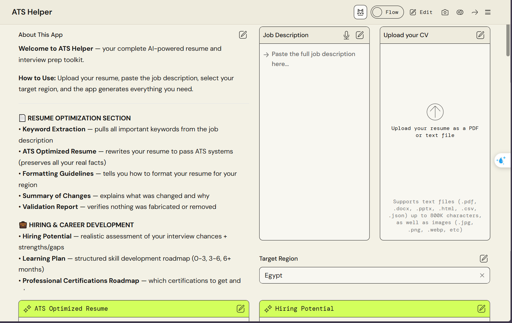
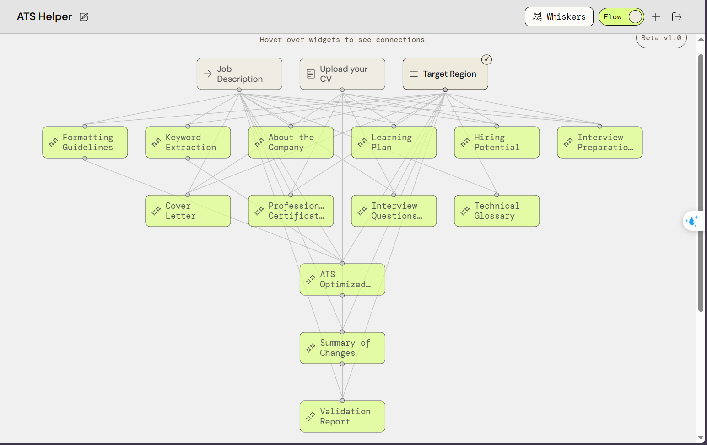

# PartyRock--ATS-Helper

**Your all-in-one AI resume & interview prep toolkit.**
Built on Amazon PartyRock, powered by Claude Sonnet 4.

<!-- 📸 Add a screenshot of the app here -->

  

---

## What is this, exactly?

You give it your resume, the job description you're chasing, and your region. It hands you back a full toolkit — an ATS-ready resume, a cover letter, an interview prep guide, and more — all built strictly from your real experience. No invented skills. No exaggerated claims. Just your story, told better.

## How it works

It only takes three inputs to generate everything below:

1. **Upload your resume**
2. **Paste the job description**
3. **Pick your target region** *(for formatting conventions)*

<!-- 🖼️ Add your widget flow diagram here -->

  

##  What you get

### Resume Optimization
- **Keyword Extraction** — pulls the key terms and skills straight from the job description
- **ATS-Optimized Resume** — rewrites your resume to pass ATS filters, real facts intact
- **Formatting Guidelines** — region-specific formatting tips
- **Summary of Changes** — a clear breakdown of what changed, and why
- **Validation Report** — confirms nothing was fabricated, exaggerated, or quietly dropped

###  Hiring & Career Development
- **Hiring Potential** — an honest read on your interview chances, plus strengths and gaps
- **Learning Plan** — a 0–3 / 3–6 / 6+ month roadmap to close the gaps
- **Certifications Roadmap** — which certifications are worth pursuing, and when

### Company & Job Insights
- **About the Company** — a deep dive into culture, tech stack, and a SWOT analysis
- **Technical Glossary** — every technical term from the posting, explained simply

###  Application Materials
- **Cover Letter** — tailored and professional, built from your actual experience

###  Interview Preparation
- **Interview Prep Guide** — focus topics, strategies, and tips for the room
- **Interview Questions Bank** — 30 scenario-based questions, with detailed answers for the 6 toughest

---

##  A quick note on honesty

Everything ATS Helper produces is checked against your real resume. It can polish, reframe, and structure — but it won't invent. What you submit will always be true, just better presented.

---

##  Built with

- [Amazon PartyRock](https://partyrock.aws/)
- Claude Sonnet 4

---

*Got feedback or a feature idea? Open an issue or just reach out — always happy to hear it.*

**⚠️ Important:** All outputs preserve your original facts — nothing is invented or exaggerated.

